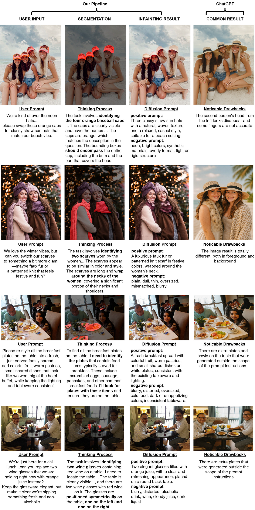
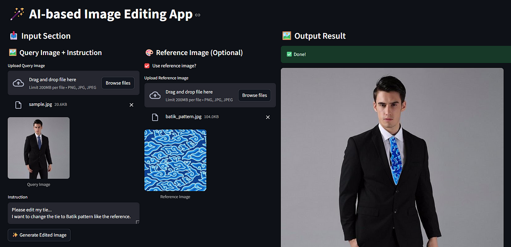

# Towards a Zero-shot Pipeline for AI-based Image Editing Application

This repository presents the implementation of a **zero-shot image editing pipeline** that combines **multimodal reasoning, segmentation, and generative inpainting**. Inspired by recent advances in multimodal LLMs and vision-language reasoning, the system bridges the gap between prompt understanding and visual manipulation—allowing both **text-guided** and **image-guided** image editing with minimal manual intervention.

📝 You can read the full article here:  
👉 [Towards A Zero-shot Pipeline for AI-based Image Editing Application – Medium](https://medium.com/@hanifsarubany10/towards-a-zero-shot-pipeline-for-ai-based-image-editing-application-4c509bc82ff1)

---

## 🧠 Key Components

- **Vision Reasoner**: Multimodal LLM (Qwen2.5-VL) fine-tuned for object localization using reasoning-chain prompts.
- **SAM-2 by Meta AI**: For zero-shot segmentation guided by bounding boxes and foreground point prompts.
- **PrefPaint (SDXL-based)**: A fine-tuned diffusion model aligned with human preferences for inpainting.
- **IP-Adapter**: For image-guided prompt conditioning during inpainting tasks.

---

## 🖼️ Visual Examples

### 🔍 Evaluation: Comparison with ChatGPT’s Native Image Editing
<p align="center">
  
</p>

> Our pipeline demonstrates superior object localization and editing accuracy compared to ChatGPT, particularly in tasks requiring visual reasoning and precise masking.

---

### 🎨 Streamlit App – Frontend Overview
<p align="center">
  
</p>

---

## ⚙️ Reproducing the Environment

```bash
# Clone the VisionReasoner base repository
git clone https://github.com/dvlab-research/VisionReasoner.git
cd VisionReasoner

# Create and activate the conda environment
conda create -n image_editing python=3.12
conda activate image_editing

# Install dependencies
pip3 install torch torchvision
pip install -r requirements.txt
pip install git+https://github.com/tencent-ailab/IP-Adapter.git
pip install diffusers groq huggingface-hub python-dotenv
pip install uvicorn fastapi streamlit
```
---
## 📦 IP-Adapter Checkpoints
The IP-Adapter checkpoints must be downloaded manually. Make sure to place the correct path in your code when loading the adapter.
```bash
mkdir IP-Adapter
cd IP-Adapter
git lfs install
git clone https://huggingface.co/h94/IP-Adapter
```
---
## 📚 Citation
If you use this work, please consider citing the following foundational papers:
```bibtex
@article{liu2025segzero,
  title        = {Seg-Zero: Reasoning-Chain Guided  Segmentation via Cognitive Reinforcement},
  author       = {Liu, Yuqi and Peng, Bohao and Zhong, Zhisheng and Yue, Zihao and Lu, Fanbin and Yu, Bei and Jia, Jiaya},
  journal      = {arXiv preprint arXiv:2503.06520},
  year         = {2025}
}

@article{liu2025visionreasoner,
  title        = {VisionReasoner: Unified Visual Perception and Reasoning via Reinforcement Learning},
  author       = {Liu, Yuqi and Qu, Tianyuan and Zhong, Zhisheng and Peng, Bohao and Liu, Shu and Yu, Bei and Jia, Jiaya},
  journal      = {arXiv preprint arXiv:2505.12081},
  year         = {2025}
}
```
